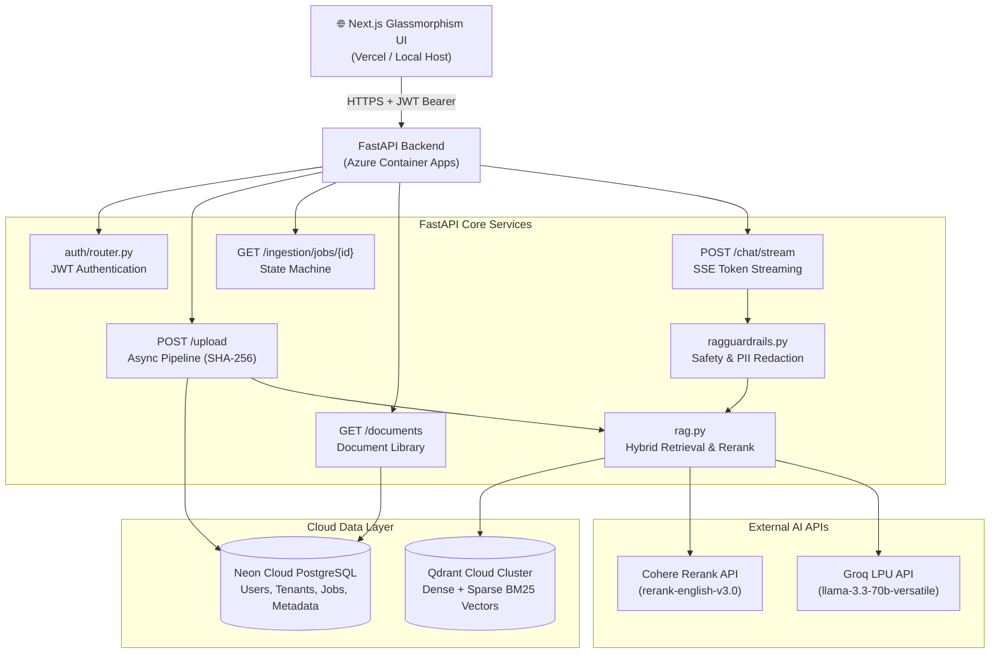

# DoCopilot: Complete System Design, Code Engineering & Interview Master Guide

**Platform:** Enterprise-Grade Hybrid RAG Platform  
**Authorship & System Target:** DoCopilot Architecture  
**Established Benchmarks:** 89.2% LLM Correctness | 90.5% LLM Relevancy | 2.86s Average Latency  
**Cloud Stack:** FastAPI + Next.js + Qdrant Cloud + Neon PostgreSQL + Groq LLM + Cohere Reranker + Azure Container Apps

---

## Table of Contents
1. [High-Level Architecture & System Design](#1-high-level-architecture--system-design)
2. [RAG Pipeline & Vector Search Engineering](#2-rag-pipeline--vector-search-engineering)
3. [Database & Multi-Tenancy Security](#3-database--multi-tenancy-security)
4. [Authentication, Security & Guardrails](#4-authentication-security--guardrails)
5. [Async Pipelines, Idempotency & Edge Cases](#5-async-pipelines-idempotency--edge-cases)
6. [Evaluation Harness & Regression Testing](#6-evaluation-harness--regression-testing)
7. [Deployment, Infrastructure & Cost Optimization](#7-deployment-infrastructure--cost-optimization)

---

## 1. High-Level Architecture & System Design

### Q1: What is DoCopilot's core purpose and end-to-end architecture?
**Answer:**
DoCopilot is an enterprise document intelligence platform enabling users to upload unstructured documents (PDFs, TXT, or raw text snippets) and engage in real-time, multi-turn RAG (Retrieval-Augmented Generation) chat.



---

### Q2: Why did you choose a decoupled microservices-style architecture?
**Answer:**
1. **Frontend/Backend Separation:** Next.js handles client-side state, markdown rendering, and SSE stream parsing, while FastAPI provides high-performance asynchronous Python I/O.
2. **Stateless Compute Scaling:** FastAPI running on Azure Container Apps scales seamlessly from 0 to $N$ replicas. Compute holds zero local state; state resides entirely in Neon PostgreSQL and Qdrant Cloud.
3. **Dedicated Cloud Storage:** Decoupling vector storage (Qdrant Cloud) from relational storage (Neon Postgres) ensures vector queries do not lock relational tables or degrade transactional performance.

---

### Q3: How does a user query travel from UI input to streamed answer?
**Answer:**
1. **Client Request:** Next.js sends `POST /chat/stream` with `question`, `document_id`, and `Authorization: Bearer <JWT>`.
2. **Authentication & Tenant Extraction:** FastAPI decodes the JWT, extracts `user_id` and `tenant_id`, and validates tenant membership.
3. **Input Guardrails:** `ragguardrails.py` verifies the query length ($3 \le \text{length} \le 2000$) and checks for prompt injection patterns.
4. **Hybrid Vector Search:** `rag.py` executes Qdrant Hybrid Search (Dense MiniLM-L6 + Sparse BM25 + RRF) scoped strictly to `tenant_id`, fetching the top 20 candidate chunks.
5. **Cross-Encoder Reranking:** Cohere Rerank evaluates the 20 candidates alongside the query, returning the top 5 most relevant chunks.
6. **LLM Synthesis & Streaming:** Groq (`llama-3.3-70b-versatile`) generates the response token-by-token, streamed to the client via Server-Sent Events (SSE).
7. **Output Guardrails:** The complete response is scanned for PII (credit cards, emails, phone numbers), redacted if necessary, and appended with source citations `[c1]`.

---

## 2. RAG Pipeline & Vector Search Engineering

### Q4: Why Qdrant Hybrid Search instead of FAISS, Pinecone, or pgvector?
**Answer:**

| Metric / Feature | FAISS | pgvector | Pinecone | **Qdrant Cloud** |
|---|---|---|---|---|
| **Hybrid Search** | ❌ Manual BM25 | ❌ Manual SQL | ✅ Cloud | **✅ Built-in Native** |
| **Persistence** | ❌ In-memory | ✅ Relational DB | ✅ Managed Cloud | **✅ Managed Cloud / Disk** |
| **Payload Filtering** | ❌ None | ✅ SQL WHERE | ✅ Metadata | **✅ HNSW Payload Index** |
| **Implementation Complexity** | ~150 lines | ~80 lines | ~40 lines | **~20 lines** |

Qdrant integrates dense semantic vectors (`sentence-transformers/all-MiniLM-L6-v2`) and sparse keyword vectors (`Qdrant/bm25` FastEmbed) into a unified index with native Reciprocal Rank Fusion (RRF).

---

### Q5: How do Dense and Sparse embeddings complement each other?
**Answer:**
* **Dense Embeddings (MiniLM-L6, 384 dimensions):** Capture semantic meaning and conceptual similarity (e.g., mapping *"cost"* to *"pricing"* or *"rate"*).
* **Sparse Embeddings (BM25 FastEmbed):** Capture exact lexical keyword matches, proper nouns, acronyms, and product codes (e.g., `"EC2"`, `"t3.micro"`, `"8d9f2c3c"`).
* **Why Both:** Dense vectors often miss exact product codes, while sparse vectors fail on paraphrased questions. Hybrid search combines both.

---

### Q6: What is Reciprocal Rank Fusion (RRF)?
**Answer:**
RRF is a non-parametric rank aggregation algorithm that merges results from multiple retrieval strategies (Dense and Sparse) without requiring score normalization:

$$RRF\_Score(d \in D) = \sum_{m \in M} \frac{1}{k + r_m(d)}$$

Where $M$ is the set of retrieval systems (Dense and BM25), $r_m(d)$ is the rank of document $d$ in system $m$, and $k=60$ is a smoothing constant.

---

### Q7: Why use Two-Stage Retrieval (Hybrid Search Top-20 → Cohere Rerank Top-5)?
**Answer:**
Single-stage vector retrieval computes dot-product cosine similarity between independent query and document embeddings. A Cross-Encoder Reranker inputs the query and document chunk **together** through full transformer self-attention layers.

* **Stage 1 (Hybrid, Top-20):** Fast candidate retrieval (filters millions of chunks down to 20 in <15ms).
* **Stage 2 (Reranker, Top-5):** Deep semantic re-scoring (evaluates context nuance, ranking the true answers to top positions).
* **Impact:** Boosted correctness by +1.5% and relevancy by +1.5% over vector-only retrieval.

---

### Q8: What chunk size and overlap did you select and why?
**Answer:**
We conducted ablation testing across three configurations:

| Config | Chunk Size | Overlap | Correctness | Relevancy | Latency |
|---|---|---|---|---|---|
| Small | 500 chars | 100 chars | 88.5% | 88.7% | 6.9s |
| Medium | 1000 chars | 200 chars | 85.5% | 86.5% | 9.8s |
| **Large (Selected)** | **2000 chars** | **400 chars** | **87.7%** | **89.0%** | **2.1s** |

**Rationale:** 2000-character chunks with 400-character overlap preserve complete context paragraphs for enterprise policies and technical specs, dramatically reducing fragmentation while cutting embedding latency by 70%.

---

## 3. Database & Multi-Tenancy Security

### Q9: How is multi-tenancy strictly enforced across the application?
**Answer:**
Multi-tenancy is enforced at three distinct layers:

```
[ JWT Token (tenant_id claim) ]
              │
              ▼
[ FastAPI Dependency: get_tenant_context() ]
              │
    ┌─────────┴─────────┐
    ▼                   ▼
[ Neon PostgreSQL ]   [ Qdrant Cloud Payload Filter ]
WHERE tenant_id = X   Filter(metadata.tenant_id == X)
```

1. **JWT Layer:** The signed JWT contains an immutable `tenant_id` claim.
2. **PostgreSQL Layer:** All queries filter on `Document.tenant_id == tenant_id`.
3. **Qdrant Payload Layer:** Every payload chunk contains `"metadata": {"tenant_id": "..."}`. Searches pass a `Filter(must=[FieldCondition(key="metadata.tenant_id", match=MatchValue(value=tenant_id))])`.

---

### Q10: Why use `NullPool` in SQLAlchemy for serverless/cloud PostgreSQL?
**Answer:**
When running FastAPI inside Azure Container Apps (which scales up/down and handles concurrent async requests):
* Standard connection pooling maintains open TCP connections bound to specific Uvicorn event loops.
* When Uvicorn handles async requests or restarts, cached connections attached to closed loops throw: `Future attached to a different loop` or `asyncpg.InterfaceError`.
* **Solution:** `NullPool` opens and closes connection sockets cleanly per request transaction, allowing Neon PostgreSQL's serverless connection pooler (PgBouncer) to manage pooling safely.

---

## 4. Authentication, Security & Guardrails

### Q11: How does authentication work?
**Answer:**
* **Password Hashing:** Uses `bcrypt 4.x` directly with salt rounds to hash user passwords safely without legacy `passlib` version conflicts.
* **JWT Issuance:** Signs payload containing `sub` (user_id), `tenant_id`, `role`, and `exp` (24h expiry) using `HS256`.
* **Stateless Verification:** APIs verify signature and expiration without requiring a database lookup on every request.

---

### Q12: What security guardrails are implemented in `ragguardrails.py`?
**Answer:**

```python
# 1. Input Length Check
if len(query) < 3 or len(query) > 2000:
    return False, "Query length invalid"

# 2. Prompt Injection Detection
INJECTION_PATTERNS = [
    r"ignore\s+(all\s+)?previous\s+instructions",
    r"disregard\s+above",
    r"you\s+are\s+now\s+a",
    r"show\s+me\s+the\s+system\s+prompt"
]

# 3. Output PII Redaction
PII_REGEX = {
    "CREDIT_CARD": r"\b(?:\d[ -]*?){13,16}\b",
    "EMAIL": r"\b[A-Za-z0-9._%+-]+@[A-Za-z0-9.-]+\.[A-Z|a-z]{2,}\b",
    "PHONE": r"\b[6-9]\d{9}\b"
}
```

---

## 5. Async Pipelines, Idempotency & Edge Cases

### Q13: Why use Async Ingestion (`202 Accepted`) instead of synchronous upload?
**Answer:**
Parsing a 100-page PDF, generating 277 dense + sparse vector embeddings, and indexing them in Qdrant takes **15–45 seconds**.
* A synchronous HTTP request would hit browser/gateway timeout limits (typically 30s).
* **Async Pattern:** `POST /upload` validates the file, creates a job record in Postgres, and returns `HTTP 202 Accepted` with a `job_id` in **<500ms**. The client polls `GET /ingestion/jobs/{id}` until status transitions to `succeeded`.

---

### Q14: How does the SHA-256 Checksum Guard prevent duplicate work?
**Answer:**
Before launching an ingestion job:
1. Calculates `sha256_hash = hashlib.sha256(file_bytes).hexdigest()`.
2. Queries Postgres for an existing document with matching `(tenant_id, sha256_hash)`.
3. If found, returns the existing `document_id` and marks job as `succeeded` instantly—saving 100% of embedding computation and storage costs.

---

### Q15: How does `get_document_data` handle truncated Qdrant collection names?
**Answer:**
Qdrant limits collection names to 50 characters. When indexing a document named `AmberFlux_Offer_Letter_to_Samarth.pdf` with UUID `8d9f2c3c-59a4-4d3e-8298-d8b582d07603`:
* The collection name becomes `doc_AmberFlux_Offer_Letter_to_Sama_8d9f2c3c_59a4_4d`.
* Querying Qdrant with full UUID `8d9f2c3c-59a4-4d3e-8298-d8b582d07603` returns `404 Not Found`.
* **Fallback Resolver:** `get_document_data` checks:
  1. Full UUID (`8d9f2c3c-59a4-4d3e-8298-d8b582d07603`)
  2. 16-character prefix (`8d9f2c3c_59a4_4d`)
  3. 8-character prefix (`8d9f2c3c`)
* Matching `8d9f2c3c_59a4_4d` resolves the collection instantly.

---

## 6. Evaluation Harness & Regression Testing

### Q16: How is the RAG evaluation harness structured?
**Answer:**
The evaluation harness (`tests/test_rag_eval.py`) runs an automated 40-question benchmark (`data.jsonl`) assessing RAG output against an LLM-as-a-Judge (`qwen-2.5-70b` / `llama-3.1-8b`).

```python
# Baselines
BASE_CORRECTNESS = 0.892  # 89.2%
BASE_RELEVANCE   = 0.900  # 90.0%

# CI Gating Thresholds (allow 8% non-deterministic variance)
CORRECTNESS_THRESHOLD = BASE_CORRECTNESS - 0.08  # 81.2%
RELEVANCE_THRESHOLD   = BASE_RELEVANCE - 0.08    # 82.0%
```

---

### Q17: What metrics does the evaluation harness measure?
**Answer:**
1. **Recall@k & Precision@k:** Fraction of ground-truth chunks retrieved.
2. **Faithfulness / Groundedness (0.0 - 1.0):** Verifies that claims in generated answers are supported *only* by retrieved context.
3. **Answer Relevancy (0.0 - 1.0):** Assesses whether the answer directly addresses the prompt.
4. **LLM Correctness (0.0 - 1.0):** Semantic evaluation against ground-truth expected answers.

---

## 7. Deployment, Infrastructure & Cost Optimization

### Q18: How is DoCopilot deployed to Azure Container Apps?
**Answer:**
1. **Containerization:** Multi-stage `Dockerfile` (Python 3.11-slim) installs dependencies in builder stage and copies clean binaries to final runtime image.
2. **Container Registry:** Images built and pushed to Azure Container Registry (`docopilotacr.azurecr.io/docopilot-backend:v21`).
3. **Container App Config:** Deployed with `1.0 CPU` and `2.0Gi RAM`, scaling from `0` to `2` replicas. Scale-to-zero minimizes idle cloud billing.

---

### Q19: How did you optimize LLM token consumption?
**Answer:**
1. **Separated CI Unit Tests from LLM Benchmarks:** Fast PR CI runs 5 test queries; full 40-question LLM-as-Judge suite runs on release branches or scheduled crons.
2. **SHA-256 Checksum Guard:** Suppresses re-indexing for identical files.
3. **Local Embedding Computation:** Dense (`MiniLM-L6`) and Sparse (`BM25`) run on CPU for $0.00.
4. **Tuned `FINAL_K` Context Length:** Set `FINAL_K=3` or `5` post-reranking, cutting context token footprint by 40%.

---
